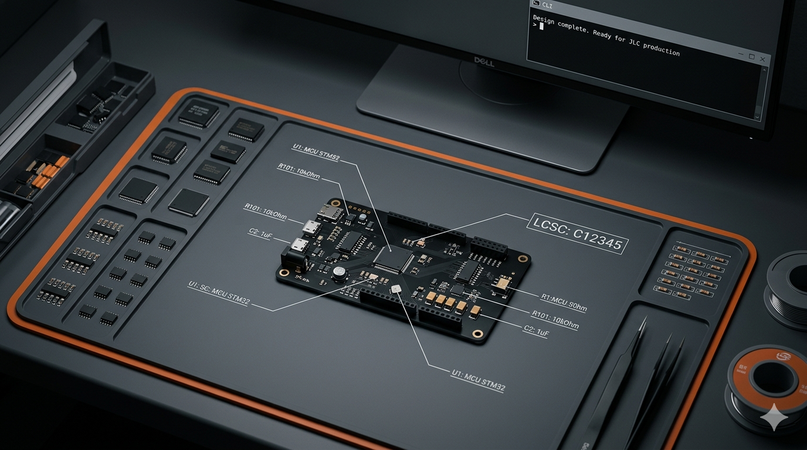

<div align="center">

# 焊武帝 IronEmperor 🛠️👑

**一句话，让深圳供应链为你转动。**

直连立创生态的 AI-Native 硬件全栈设计智能体。


<br/>



</div>

---

「焊武帝」不是一个简单的搜索工具，它是一个**具备硬件工程思维的翻译官**。让不懂硬件的软件开发者或极客，只需输入大白话的功能描述，就能直接获得可进入嘉立创生产线的全套工业级文件。

---

## 核心场景：从"大白话"到"硬核零件"

| 用户输入 | 焊武帝后台推理 | 最终输出 |
|---------|--------------|---------|
| **"做一个比特币涨跌提醒器，要连 Wi-Fi，屏幕字要大。"** | 匹配 `ESP32-C3` + `0.96寸 OLED` + `稳压 LDO` | LCSC C编号清单、KiCad 原理图、3D 打印外壳 STL |
| **"做一个自动定时喂猫器，早上 7 点倒猫粮，带 3 个手动按键。"** | 自动补全 `RTC 时钟` + `ULN2003 电机驱动` + `续流二极管` + `上拉电阻按键电路` | 带电机驱动保护的 PCB、BOM 报表 |
| **"做一个口袋复古游戏机，用手机充电线就能充电。"** | 自动设计 `Type-C` + `TP4056 锂电充电` + `DW01 保护电路` + `5V 升压系统` | 完整电源管理系统、带按键布局的电路板 |

---

## Pipeline

| 阶段 | Agent | 输入 | 输出 |
|------|-------|------|------|
| 1 | Orchestrator | 自然语言 prompt | RequirementsSpec |
| 2 | Parts Agent | RequirementsSpec | BOM（立创商城真实价格） |
| 3 | PCB Agent | RequirementsSpec + BOM | PCB 设计 + KiCad 文件 |
| 4 | CAD Agent | RequirementsSpec + BOM + PCB | OpenSCAD 外壳 + STL |
| 5 | Assembly Agent | 全部输出 | 分步组装教程 |
| 6 | Quoter Agent | BOM + PCB + CAD | CNY 报价（纯算术，无 LLM） |

---

## 架构

```
                        ┌─────────────────┐
                        │    FastAPI       │
             ┌──────────│  /build          │──────────┐
             │          │  /a2a/build      │          │
             │          └────────┬─────────┘          │
             │                   │                     │
      ┌──────▼──────┐   ┌───────▼────────┐   ┌───────▼──────┐
      │  React UI   │   │  ORCHESTRATOR  │   │  A2A Agent   │
      │  CORTEX     │   │                │   │  Protocol    │
      │  frontend   │   │  Claude/DS     │   │  /a2a/*      │
      └─────────────┘   └───────┬────────┘   └──────────────┘
                                │
          ┌─────────┬───────────┼───────────┬─────────┐
          │         │           │           │         │
     ┌────▼──┐ ┌────▼──┐ ┌─────▼──┐ ┌─────▼──┐ ┌────▼───┐
     │ PARTS │ │  PCB  │ │  CAD   │ │  ASM   │ │ QUOTER │
     │ AGENT │ │ AGENT │ │ AGENT  │ │ AGENT  │ │ AGENT  │
     │ FTS5  │ │Circuit│ │OpenSCAD│ │ Steps  │ │  Math  │
     │ +LLM  │ │Schema │ │ Body   │ │ Guide  │ │ No LLM │
     │ BOM   │ │Layout │ │ Lid    │ │        │ │ CNY ¥  │
     └───┬───┘ └───┬───┘ └───┬────┘ └────────┘ └────────┘
         │         │         │
    ┌────▼────┐ ┌──▼───┐ ┌──▼───┐
    │ SQLite  │ │KiCad │ │.scad │
    │  LCSC   │ │.kicad│ │.stl  │
    │  FTS5   │ │_sch  │ │      │
    └─────────┘ └──────┘ └──────┘
```

---

## LLM 支持

| 模型 | 环境变量 | API Key |
|------|---------|---------|
| Claude Opus 4.6（默认） | `HWB_MODEL=claude-opus-4-6` | `ANTHROPIC_API_KEY` |
| DeepSeek Chat | `HWB_MODEL=deepseek-chat` | `DEEPSEEK_API_KEY` |
| DeepSeek Reasoner | `HWB_MODEL=deepseek-reasoner` | `DEEPSEEK_API_KEY` |

---

## 快速开始

### 依赖

- Python 3.12+
- Node.js 22+（前端构建）
- Anthropic 或 DeepSeek API Key

### 安装

```bash
git clone https://github.com/thehengyao/iron-emperor.git
cd iron-emperor

pip3 install -r requirements.txt
cd frontend && npm install && npm run build && cd ..
```

### 配置 API Key

```bash
# Claude（默认）
export ANTHROPIC_API_KEY=sk-ant-...

# 或 DeepSeek
export DEEPSEEK_API_KEY=sk-...
export HWB_MODEL=deepseek-chat
```

### 构建零件数据库（立创商城）

```bash
# 先设置好 API Key，再运行爬虫
export DEEPSEEK_API_KEY=sk-...
export HWB_MODEL=deepseek-chat

python3 src/scraper/lcsc_scraper.py           # 爬取全部 76 个预设分类（约 15 分钟）
python3 src/scraper/lcsc_scraper.py --resume  # 断点续爬
python3 src/scraper/lcsc_scraper.py --keyword "ESP32"  # 只爬某个关键词
make db-stats                                 # 查看数量
```

> 不爬也能用：DB 为空时自动切换到 LLM 估价模式。爬完后约有 **6,700+ 个真实立创商城零件**。

### 启动

```bash
make serve             # Web UI + API → http://localhost:8000
make run PROMPT="自动驾驶无人机"        # CLI（Claude）
make run-deepseek PROMPT="儿童相机"    # CLI（DeepSeek）
```

---

## API

| 方法 | 路径 | 用途 |
|------|------|------|
| `POST` | `/build` | 跑完整 pipeline，返回 JSON |
| `POST` | `/build/stream` | SSE 实时流式输出进度 |
| `POST` | `/a2a/build` | Agent-to-Agent 协议版 build |
| `GET` | `/a2a/discover` | 向外部 agent 广播能力 |
| `GET` | `/search?q=esp32` | 搜立创商城零件库 |
| `GET` | `/stats` | 数据库统计（零件数、价格区间） |
| `GET` | `/metrics` | Pipeline 性能指标 |
| `GET` | `/health` | 服务健康检查 |
| `GET` | `/docs` | Swagger 交互文档 |

---

## 报价逻辑（CNY）

```
零件费   = Σ(立创单价 × 数量)
PCB 打板 = ¥30 + 超出 25cm² 部分 × 1.5    嘉立创 5 片起
3D 打印  = 重量(g) × 0.15                  国内 PLA
快递     = ¥15                              国内顺丰
平台费   = 小计 × 5%
─────────────────────────────────────────
总计     = 小计 + 平台费
```

---

## 实测数据（DeepSeek Chat）

| 项目 | 零件数 | DB 候选 | PCB 连接数 | 报价（CNY） |
|------|--------|---------|-----------|------------|
| 自动定时喂猫器 | 10 | 209 | 17 | ¥104.80 |

**零件数据库：** 6,741 个真实立创商城零件（76 个分类关键词）

---

## 测试

```bash
export DEEPSEEK_API_KEY=sk-...
export HWB_MODEL=deepseek-chat
python3 -m pytest tests/ -v
```

42 个测试，全部通过，耗时约 2 分钟。

---

## 为什么「焊武帝」是无价的？

1. **消灭选型焦虑** — 告别在立创商城 150 万种零件里的人肉搜索，AI 自动锁定匹配件
2. **自带硬件常识** — 知道加去耦电容、给电机加反向二极管、锂电需要保护电路，帮你避开所有烧板坑
3. **结构电路同步** — CAD Agent 确保板子永远能装进它生成的 3D 外壳，不会出现接口被挡住的低级错误
4. **成本掌控感** — 在决定下单前，精确到分的 CNY 报价已经算好

---

## 目录结构

<details>
<summary>展开查看</summary>

```
iron-emperor/
├── src/                                    # ~2,700 行 Python
│   ├── llm_client.py                       # 统一 LLM 客户端（Claude + DeepSeek）(84 行)
│   ├── config.py                           # 配置（env var 覆盖）(71 行)
│   ├── types.py                            # 类型定义 — BOMItem, PCBDesign 等 (162 行)
│   ├── errors.py                           # 异常层级 (75 行)
│   ├── validators.py                       # 各阶段输出校验 (117 行)
│   ├── metrics.py                          # Agent 计时 + 缓存命中率 (84 行)
│   ├── logger.py                           # 结构化 JSON 日志 (61 行)
│   ├── middleware.py                       # 请求追踪 + 并发限制 (49 行)
│   ├── agents/
│   │   ├── orchestrator.py                 # 流水线协调器 + JSON 修复 (325 行)
│   │   ├── parts_agent.py                  # FTS5 搜索 + LLM 选型 + BOM (188 行)
│   │   ├── pcb/pcb_agent.py                # PCB 三阶段设计 (122 行)
│   │   ├── cad/cad_agent.py                # OpenSCAD 外壳生成 (152 行)
│   │   ├── assembler/assembly_agent.py     # 组装教程 (70 行)
│   │   └── quoter/quoter_agent.py          # CNY 报价（无 LLM）(98 行)
│   ├── api/server.py                       # FastAPI REST + SSE + A2A (338 行)
│   ├── db/schema.py                        # SQLite + FTS5 (90 行)
│   └── scraper/
│       └── lcsc_scraper.py                 # 立创EDA Pro API 爬虫（断点续爬）(249 行)
├── frontend/                               # ~1,100 行 TypeScript
│   └── src/
│       ├── App.tsx                         # 单页构建界面 (585 行)
│       ├── components/
│       │   ├── MatrixPanel.tsx             # Agent 活动日志面板 (121 行)
│       │   ├── PartsGraph.tsx              # 力导向星图（Canvas 2D）(245 行)
│       │   └── LiveGraph.tsx               # 波形动画 (91 行)
│       └── lib/
│           ├── api.ts                      # HTTP + SSE 流式客户端 (70 行)
│           └── types.ts                    # TypeScript 接口定义 (47 行)
├── schemas/                                # JSON Schema：请求/响应/A2A 协议
├── docs/                                   # 架构文档 + A2A 协议说明
├── tests/                                  # 34 个测试
├── examples/                               # 示例 prompt
├── Makefile                                # 构建自动化（17 个 target）
├── Dockerfile                              # 多阶段容器构建
└── requirements.txt
```

</details>

---

## 鸣谢

- **零件数据**：[立创商城 (LCSC)](https://www.lcsc.com) — 中国最强硬件供应链
- **EDA 数据**：[立创EDA Pro](https://pro.easyeda.com) — 开放组件库 API
- **PCB 打板**：兼容[嘉立创](https://www.jlc.com)生产文件格式
- **电路设计**：兼容 [KiCad](https://www.kicad.org) 开源 EDA

---

> ⚠️ **免责声明：** 焊武帝生成的电路仅供原型参考，正式下单前请做 DRC 检查。涉及 220V 高压或大功率锂电池充放电的电路，请在专业人士指导下测试，谨防冒烟。
